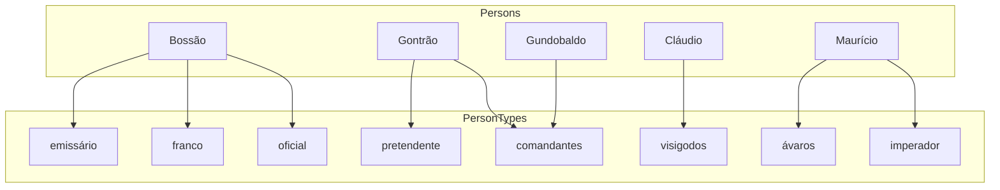

# Usando azure IA para extração de entidades.

Nele enviamos o seguinte texto como entrada, que foi extradido desse artigo(https://pt.wikipedia.org/wiki/Boss%C3%A3o_(duque)):

```
Bossão (em latim: Bosso) foi um oficial franco do século VI, ativo durante o reinado de Gontrão (r. 561–592).

Em 585, Bossão foi um dos comandantes do exército de Gontrão que sitiaram o pretendente Gundobaldo em Cominges. Ele e Ulão capturaram Gundobaldo e mataram-o. Em 589, foi enviado por Gontrão com Antéscio para capturar cidades da Septimânia. Por sua confiança, foi descuidado e foi emboscado pelos visigodos sob Cláudio próximo de Carcassona, sendo obrigado a fugir com pesadas baixas. Talvez pode ser associado ao emissário Bossão enviado por Teodorico II (r. 595–613) com Beto para oferecer ajuda militar ao imperador Maurício (r. 582–602) contra os ávaros em 598.[1] 
```

Com esse texto obtivemos a seguinte saída:

```json
{
  "documents": [
    {
      "redactedText": "****** (em latim: *****) foi um ******* ****** do século VI, ativo durante o reinado de ******* (r. 561–592).\n\nEm 585, ****** foi um dos *********** do exército de ******* que sitiaram o *********** ********** em Cominges. Ele e **** capturaram ********** e mataram-o. Em 589, foi enviado por ******* com ******** para capturar cidades da Septimânia. Por sua confiança, foi descuidado e foi emboscado pelos ********* sob ******* próximo de Carcassona, sendo obrigado a fugir com pesadas baixas. Talvez pode ser associado ao ********* ****** enviado por ************ (r. 595–613) com **** para oferecer ajuda militar ao ********* ******** (r. 582–602) contra os ****** em 598.",
      "id": "1",
      "entities": [
        {
          "text": "Bossão",
          "category": "Person",
          "type": "Person",
          "offset": 0,
          "length": 6,
          "confidenceScore": 0.96,
          "tags": [
            {
              "name": "Person",
              "confidenceScore": 0.96
            }
          ]
        },
        {
          "text": "Bosso",
          "category": "Person",
          "type": "Person",
          "offset": 18,
          "length": 5,
          "confidenceScore": 0.81,
          "tags": [
            {
              "name": "Person",
              "confidenceScore": 0.81
            }
          ]
        },
        {
          "text": "oficial",
          "category": "PersonType",
          "type": "PersonType",
          "offset": 32,
          "length": 7,
          "confidenceScore": 0.96,
          "tags": [
            {
              "name": "PersonType",
              "confidenceScore": 0.96
            }
          ]
        },
        {
          "text": "franco",
          "category": "PersonType",
          "type": "PersonType",
          "offset": 40,
          "length": 6,
          "confidenceScore": 0.54,
          "tags": [
            {
              "name": "PersonType",
              "confidenceScore": 0.54
            }
          ]
        },
        {
          "text": "Gontrão",
          "category": "Person",
          "type": "Person",
          "offset": 88,
          "length": 7,
          "confidenceScore": 0.95,
          "tags": [
            {
              "name": "Person",
              "confidenceScore": 0.95
            }
          ]
        },
        {
          "text": "Bossão",
          "category": "Person",
          "type": "Person",
          "offset": 119,
          "length": 6,
          "confidenceScore": 0.99,
          "tags": [
            {
              "name": "Person",
              "confidenceScore": 0.99
            }
          ]
        },
        {
          "text": "comandantes",
          "category": "PersonType",
          "type": "PersonType",
          "offset": 137,
          "length": 11,
          "confidenceScore": 0.89,
          "tags": [
            {
              "name": "PersonType",
              "confidenceScore": 0.89
            }
          ]
        },
        {
          "text": "Gontrão",
          "category": "Person",
          "type": "Person",
          "offset": 164,
          "length": 7,
          "confidenceScore": 0.84,
          "tags": [
            {
              "name": "Person",
              "confidenceScore": 0.84
            }
          ]
        },
        {
          "text": "pretendente",
          "category": "PersonType",
          "type": "PersonType",
          "offset": 187,
          "length": 11,
          "confidenceScore": 0.64,
          "tags": [
            {
              "name": "PersonType",
              "confidenceScore": 0.64
            }
          ]
        },
        {
          "text": "Gundobaldo",
          "category": "Person",
          "type": "Person",
          "offset": 199,
          "length": 10,
          "confidenceScore": 0.95,
          "tags": [
            {
              "name": "Person",
              "confidenceScore": 0.95
            }
          ]
        },
        {
          "text": "Ulão",
          "category": "Person",
          "type": "Person",
          "offset": 229,
          "length": 4,
          "confidenceScore": 0.99,
          "tags": [
            {
              "name": "Person",
              "confidenceScore": 0.99
            }
          ]
        },
        {
          "text": "Gundobaldo",
          "category": "Person",
          "type": "Person",
          "offset": 245,
          "length": 10,
          "confidenceScore": 0.99,
          "tags": [
            {
              "name": "Person",
              "confidenceScore": 0.99
            }
          ]
        },
        {
          "text": "Gontrão",
          "category": "Person",
          "type": "Person",
          "offset": 293,
          "length": 7,
          "confidenceScore": 0.99,
          "tags": [
            {
              "name": "Person",
              "confidenceScore": 0.99
            }
          ]
        },
        {
          "text": "Antéscio",
          "category": "Person",
          "type": "Person",
          "offset": 305,
          "length": 8,
          "confidenceScore": 0.98,
          "tags": [
            {
              "name": "Person",
              "confidenceScore": 0.98
            }
          ]
        },
        {
          "text": "visigodos",
          "category": "PersonType",
          "type": "PersonType",
          "offset": 407,
          "length": 9,
          "confidenceScore": 0.93,
          "tags": [
            {
              "name": "PersonType",
              "confidenceScore": 0.93
            }
          ]
        },
        {
          "text": "Cláudio",
          "category": "Person",
          "type": "Person",
          "offset": 421,
          "length": 7,
          "confidenceScore": 0.97,
          "tags": [
            {
              "name": "Person",
              "confidenceScore": 0.97
            }
          ]
        },
        {
          "text": "emissário",
          "category": "PersonType",
          "type": "PersonType",
          "offset": 524,
          "length": 9,
          "confidenceScore": 0.73,
          "tags": [
            {
              "name": "PersonType",
              "confidenceScore": 0.73
            }
          ]
        },
        {
          "text": "Bossão",
          "category": "Person",
          "type": "Person",
          "offset": 534,
          "length": 6,
          "confidenceScore": 0.89,
          "tags": [
            {
              "name": "Person",
              "confidenceScore": 0.89
            }
          ]
        },
        {
          "text": "Teodorico II",
          "category": "Person",
          "type": "Person",
          "offset": 553,
          "length": 12,
          "confidenceScore": 0.98,
          "tags": [
            {
              "name": "Person",
              "confidenceScore": 0.98
            }
          ]
        },
        {
          "text": "Beto",
          "category": "Person",
          "type": "Person",
          "offset": 583,
          "length": 4,
          "confidenceScore": 0.99,
          "tags": [
            {
              "name": "Person",
              "confidenceScore": 0.99
            }
          ]
        },
        {
          "text": "imperador",
          "category": "PersonType",
          "type": "PersonType",
          "offset": 619,
          "length": 9,
          "confidenceScore": 0.65,
          "tags": [
            {
              "name": "PersonType",
              "confidenceScore": 0.65
            }
          ]
        },
        {
          "text": "Maurício",
          "category": "Person",
          "type": "Person",
          "offset": 629,
          "length": 8,
          "confidenceScore": 0.98,
          "tags": [
            {
              "name": "Person",
              "confidenceScore": 0.98
            }
          ]
        },
        {
          "text": "ávaros",
          "category": "PersonType",
          "type": "PersonType",
          "offset": 661,
          "length": 6,
          "confidenceScore": 0.91,
          "tags": [
            {
              "name": "PersonType",
              "confidenceScore": 0.91
            }
          ]
        }
      ],
      "warnings": []
    }
  ],
  "errors": [],
  "modelVersion": "2025-02-01"
}
```

Essa saída eu transformei em um gráfico para melhor visualização, e removi os dados sem relacionamentos.



Nesse exemplo, conseguimos organizar a informação, de modo que facilita o entendimento, e também o processamento dessas informações por um software.

